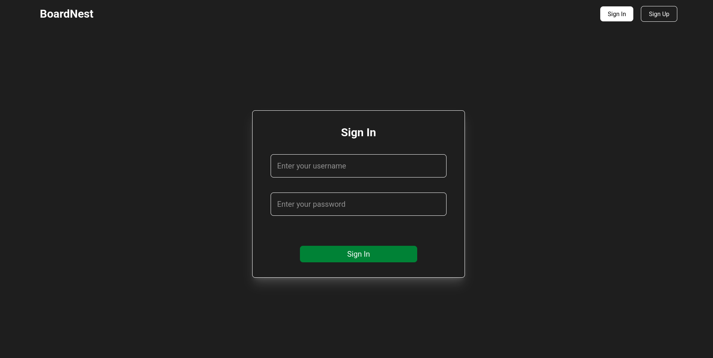
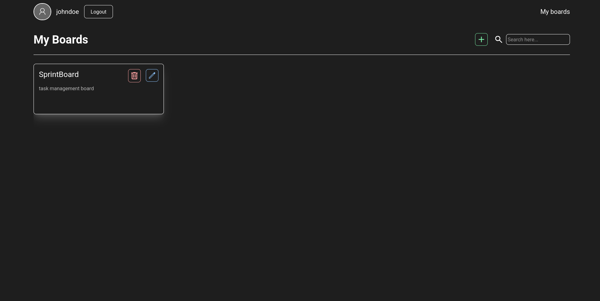
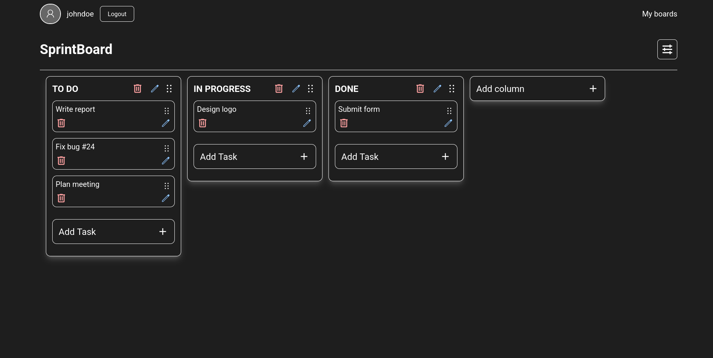
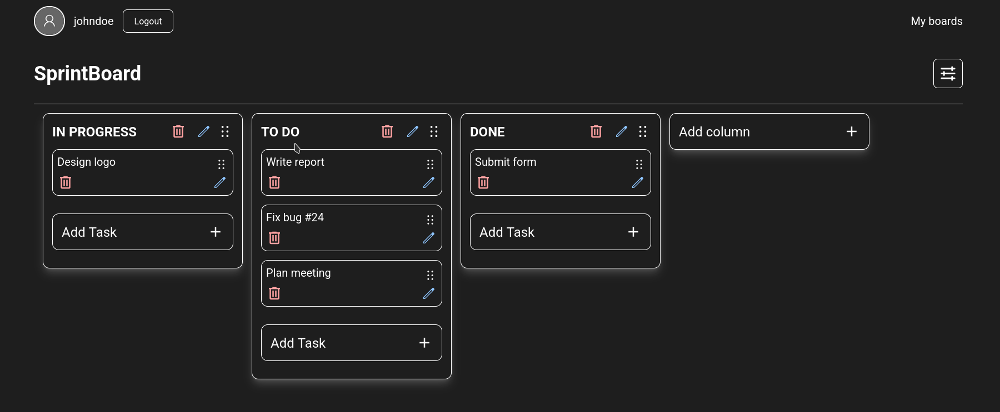
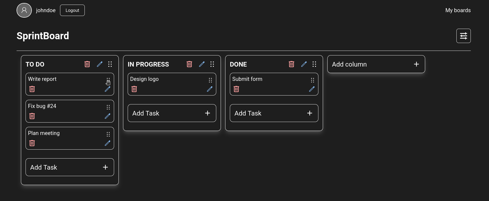

# BoardNest
Kanban-style task management web app that enables users to organize workflows, visualize task progress through customizable boards.
# Tech Stack

- **Node.js**
- **TypeScript**
- **Express.js**
- **Swagger**
- **CORS**
- **jsonwebtoken**
- **React**
- **Tailwind**
- **JSX**
- **Sequelize**

# Screenshots
## Sign In

## User Boards

## Board

## Reorder columns

## Reorder tasks


# Installation

## Backend

1. **Clone the repository.**

   ````bash
   git clone https://github.com/ismaelvr1999/boardnest.git
   ````

2. **Install dependencies.**

   ````bash
   cd  boardnest
   cd  backend
   pnpm install
   ````

3. **Set up environment variables.**
Create a .env file add the following variables:
   ```env
   DB_HOST = 
   DB_USER = 
   DB_PASSWORD = 
   DB_NAME = 
   FRONTEND_URL = 

   PORT = 
   JWT_SECRET = 
   ```
4. **Start the server.**
    ```bash
    pnpm run dev
    ```
## Frontend

1. **Install dependencies.**

   ````bash
   cd  boardnest
   cd  frontend
   pnpm install
   ````

2. **Set up environment variables.**
Create a .env file add the following variables:
   ```env
   VITE_API_URL = 
   ```
3. **Start the client.**
    ```bash
    pnpm run dev
    ```

# Running the Boardnest App with Docker

## 1. Set up backend environment variables

Create a `.env` file inside the `backend` folder and add the following variables:

```env
DB_HOST=database
DB_USER=root
DB_PASSWORD=your_password_here   # Use the same password as in your docker-compose file
DB_NAME=boardnest
FRONTEND_URL=http://localhost:5000  # Use the frontend's exposed port
PORT=3000
JWT_SECRET=your_jwt_secret_here
```
## 2. Set up frontend environment variables
Create a .env file inside the frontend folder and add the following variable:
```env
VITE_API_URL=http://localhost:4000/   # Use the backend's exposed port
```
## 3. Configure MariaDB root password in compose.yml
Make sure the MARIADB_ROOT_PASSWORD in your docker-compose.yml matches the DB_PASSWORD used in the backend .env file.
## 4. Run Docker Compose
From the root directory (e.g., boardnest), run:
```bash
docker compose up
```

# Api Documentation

The documentation is available at the following URL:

**http://localhost:your_port/api-docs**


